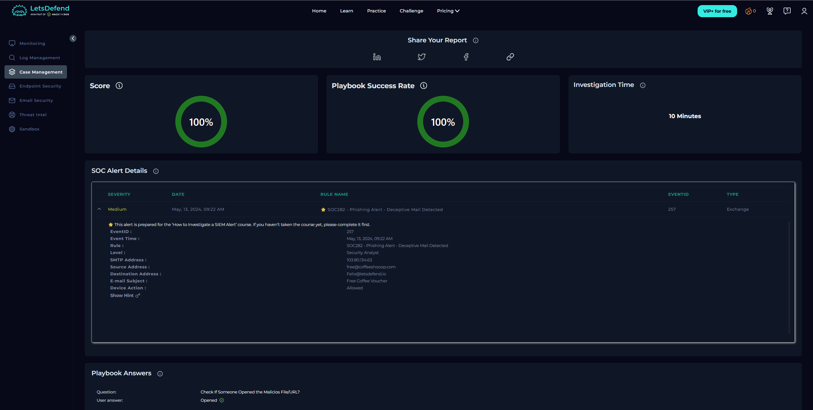
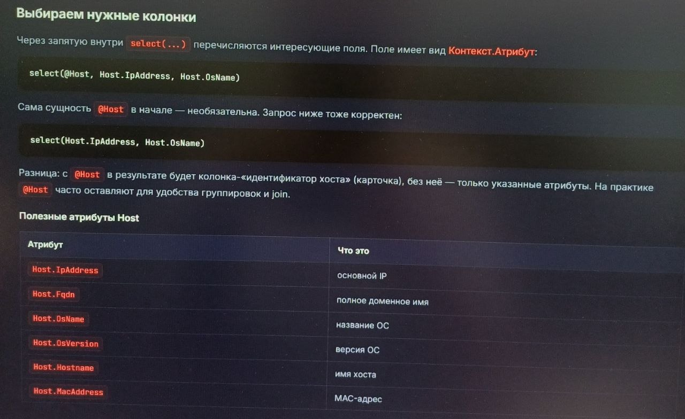
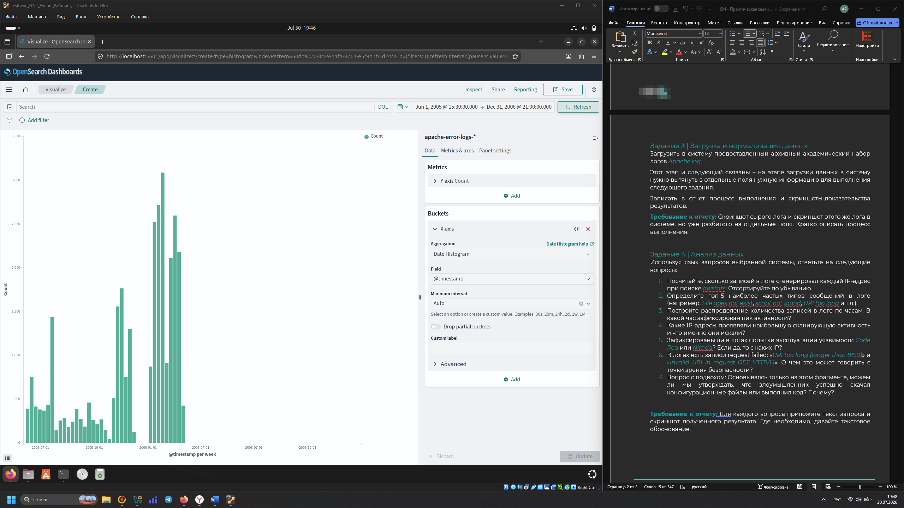
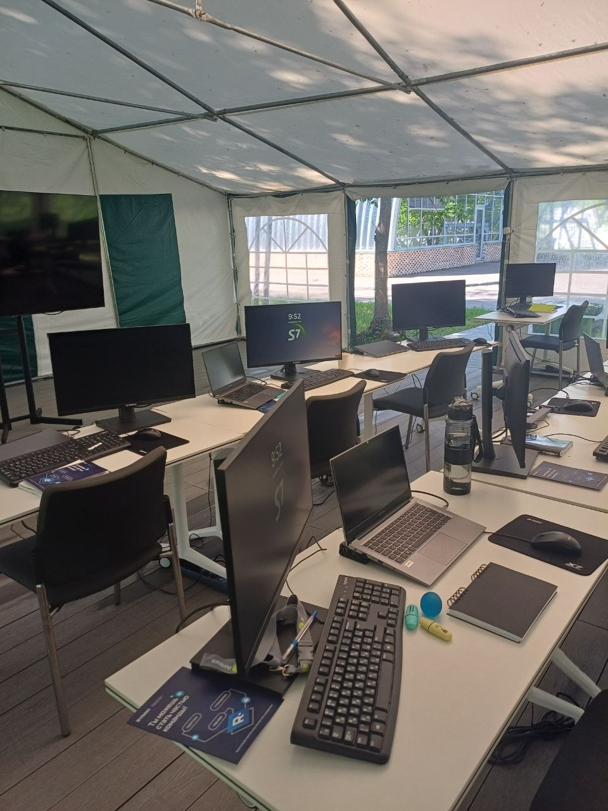
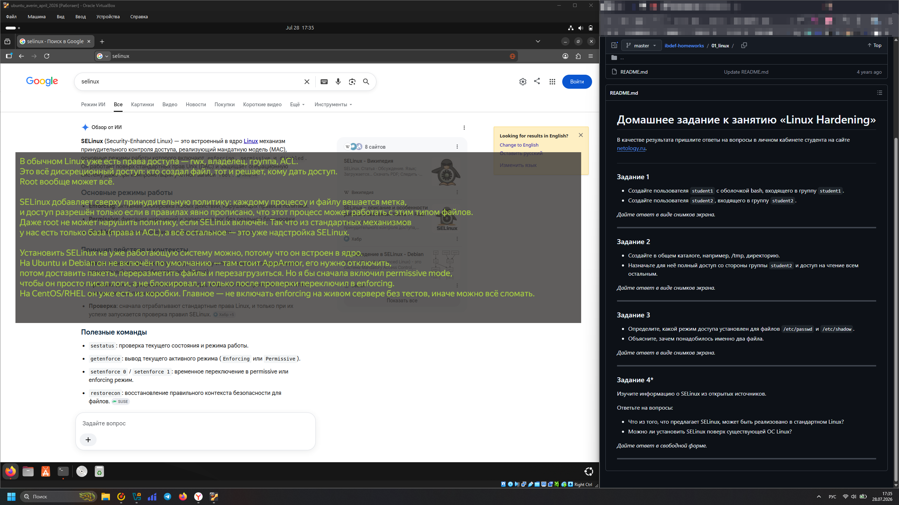

### 👋 Привет, я Александр

Начинающий специалист в области информационной безопасности. Интересуюсь Linux, анализом уязвимостей и Application Security. Учусь находить неочевидные проблемы и автоматизировать рутинные задачи.

---

### 🛠️ Что я использую

*   **Языки и скрипты:** `Python`, `Bash`, `SQL/PDQL`
*   **Операционные системы:** `Linux (Kali, Ubuntu)`, `Windows Server`
*   **Средства защиты:** `SIEM (MaxPatrol, RuSIEM)`, `NGFW (UserGate)`, `EDR (Kaspersky)`, `DLP (Zecurion)`
*   **Инструменты:** `Git`, `Docker`, `VirtualBox`

---

### 💼 Опыт

**Яндекс.Крауд** | *Тренер искусственного интеллекта* | Март 2023 — Декабрь 2024
*   Провёл 8 000+ проверок YandexGPT на безопасность и достоверность.
*   Выявил 200 критических ошибок и логических противоречий.
*   Тестировал модели и предлагал изменения в инструкции для других проверяющих, что повысило качество работы команды на 20%.

**S7 Airlines** | *Участник интенсивного буткемпа по подготовке операторов SOC L1* | Июнь 2026
*   Освоил работу с SIEM (MaxPatrol, RuSIEM) — настройка корреляций, обработка инцидентов.
*   Администрировал NGFW (UserGate) и DLP Zecurion на учебных стендах.
*   Настроил политики безопасности, анализировал трафик и уязвимости (CVE, BDU).

**ООО "ПИЛОТ"** | *Специалист по сетевой безопасности* | Март 2023 — Декабрь 2024
*   Участвовал в создании и поддержании корпоративной сети (VLAN, NGFW, VPN) для 50+ пользователей.
*   Обеспечивал мониторинг, восстановление после сбоев и обучал сотрудников работе с сетевыми сервисами.

---

### 📜 Обучение

*   **«Киберзащитник»** — курс от S7 Airlines (2026)
*   **Специалист по информационной безопасности** — Нетология (2026)
*   **Бакалавр стратегического менеджмента** — РГРТУ (2016)

---

### 📫 Контакты

*   **Telegram:** [@rabotaet_averin](https://t.me/rabotaet_averin)
*   **Email:** rabotaet.averin@gmail.com

### 📸 Активности / Примеры практики (Здесь я собираю примеры своих работ + интересные ивенты, связанные с ИБ)

---

#### 🖥️ Учебный инцидент на LetsDefend. Отработка фишинговой атаки.

> **Отработал учебный фишинг на LetsDefend:** письмо с вредоносной ссылкой доставлено, пользователь перешёл по ней. Подтвердил атаку, классифицировал как реальную, передал для реагирования. Закрепил навык анализа почтовых угроз.

---

#### 🔐 Отработка языка PDQL на тренажёре специалистов S7

> Практика написания запросов на PDQL (язык, близкий к SQL) для поиска и фильтрации событий в SIEM. Отработал логику корреляции и анализа данных в рамках буткемпа S7 Airlines.

---

#### 🌐 Отработка тестового задания «OpenSearch + OpenSearch Dashboards + Logstash»

> **Задача:** Настроить визуализацию в OpenSearch Dashboards.  
> **Результат:** Построил Date Histogram по полю `@timestamp` для распределения записей по часам и определения пика активности.

---

#### 🏢 Экскурсии в SOC Сбера и буткемп S7

<table>
  <tr>
    <td></td>
    <td></td>
  </tr>
  <tr>
    <td align="center"><b>Экскурсия в SOC Сбера, Москва</b></td>
    <td align="center"><b>Интенсив SOC L1 в S7 Airlines</b></td>
  </tr>
</table>

---

#### 💼 Отработка Linux Hardening на лабораторной работе в Нетологии

> Практическая настройка безопасной конфигурации Linux-системы: отключение неиспользуемых сервисов, настройка прав доступа, управление пользователями, настройка фаервола и аудит безопасности.

---
